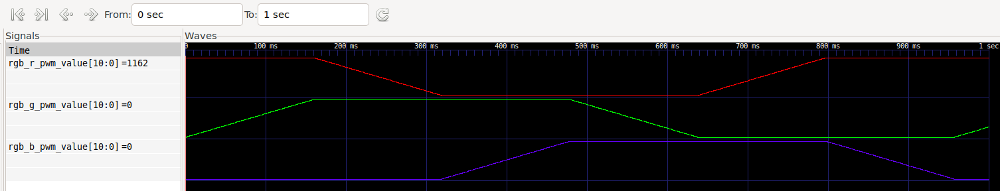

# ENGR3410: Miniproject 2 -- Smooth HSV Color Wheel 
Eddy Pan

## Reusing `fade` example code
For this Miniproject, I based my implementation of a smooth HSV Color Wheel on the example `fade` program from the iceBlinkPico repository. Much of the infrastructure of the `fade` example would prove reusable. 

At a high level, I understood the `pwm` module to be a helper module to help me take a PWM value and map it to digital output of the RGB channel. Therefore, I decided to keep the `pwm` module from the example untouched, as its reusability lends itself well to deal with three RGB channels rather than just one LED.

Additionally, the implementation of the example `fade` module offered the infrastructure for increasing and decreasing the `pwm_value` like triangle waveforms. Thus, I adapted the existing code to create trapezoidal wave forms--increasing for one step, holding high for two steps, decreasing for one step, then holding low for two steps--to match my waveform up with a single channel of RGB in the provided graph.

# Implementation
In my `top` module, I decided to use three pairs of `fade` and `pwm` modules: one for each RGB channel. While I recognize the possibility to combine the `fade` and `pwm` modules together, I found that keeping them separate lends this implementation to be more modular and readable. 

To each `fade` module, I would input the clock `clk`, and the `PWM_INTERVAL` as the example originally had, as well as a 3-bit integer to represent the initial state. The output of the `fade` module, `pwm_value`, is then piped to its respective `pwm` module to determine the state of its RGB channel (on/off).

## `fade` module
The `fade` module consists of a finite state machine (FSM) with 6 states: increasing (PWM_INC), high 1 (PWM_HI), high 2 (PWM_HI2), decreasing (PWM_DEC), low 1 (PWM_LO), and low 2 (PWM_LO2). These states represent all of the possibilities for each 60 degree segment in the HSV color wheel to generate trapezoidal waveforms. Note the distinction between 'duplicate' states such as PWM_HI and PWM_HI or PWM_LO and PWM_LO2: while their behavior is almost exactly the same (hold their PWM value at either the max or at 0), this differentiation is in place for code-readability. With PWM_HI as an example, an alternative implementation is to use a flag to denote the first or second stage of the signal. While this alternative implementation has an argument of being more modular, I decided to go with the readability of having multiple states with similar behavior.

After defining these 6 states alongside the logic datatypes carried over from the `fade` example code, I define my `initial` block to set the `pwm_value` accordingly to the `INITIAL_STATE` provided as an input to the `fade` module. 

Next is the `always_ff @(posedge time_to_transition)` that handles the state change whenever the `time_to_transition` flag has a rising edge.

Then, an `always_comb` block to compute the `next_state` of the FSM which follows trapezoidal waveform logic.

Finally, there are three `always_ff` blocks to handle counters for updating values and to time transitions: 

- One on `posedge clk` (rising edge of each clock tick) that flips the `time_to_inc_dec` flag whenever count reaches the `INC_DEC_INTERVAL`, then resets count.

- The next on `posedge time_to_inc_dec` (rising edge of the flag set in the previous `always_ff` block) to update the `pwm_value` based on the current state.

- Lastly, another one on `posedge time_to_inc_dec` that updates a counter on how many times the `time_to_inc_dec` flag has been updated. Once the counter has reached `INC_DEC_MAX - 1`, the `time_to_transition` flag flips.

## `pwm` module
The `pwm` module used in this implementation to recreate the HSV color wheel with smooth transitions is the same as the `fade` example's `pwm` module. It takes in an input clock `clk`  and `pwm_value` input that it gets from the `fade` module. Then, in the `always_ff@(posedge clk)` block that runs on the rising edge of a clock tick, it increases the `pwm_count` counter until it hits the `pwm_interval - 1`. Then, the `pwm_count` variable is reset.

Finally, `pwm_out`  is assigned a binary value (0 or 1) on the condition `pwm_count > pwm_value`. The inverse of `pwm_out` is then passed on to the `RGB_R`, `RGB_G`, and `RGB_B` channels.

## `top` module
The `top` module brings together the HSV color wheel. The `fade` and `pwm` modules are only able to handle one channel. However, since `top` will write to all three RGB channels, logic datatypes for `rgb_*_pwm_value` and `rgb_*_pwm_out` are defined at the start for each R, G, B.

Next, there are three `fade`-`pwm` module pairs for each RGB channel. `u1` and `u2` correspond to the `RGB_R` channel, `u3` and `u4` correspond to the `RGB_G` channel, and `u5` and `u6` correspond to the `RGB_B` channel. Their outputs are all saved in `rgb_*_pwm_out`, which each of the output `RGB_R`, `RGB_G`, and `RGB_B` channels are assigned to the inverse of due to the iceBlinkPico active-low configuration.

# Results
Running through simulation yields this graph:

In this graph of duty cycles of each RGB channel over time, there is visible alignment with the `RGB components versus hue angle, H.` figure provided in the Miniproject 2 descriptions to serve as a form of validation.