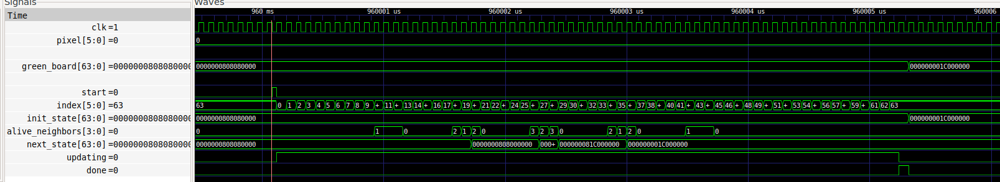
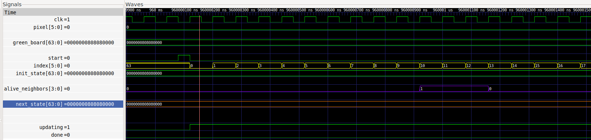
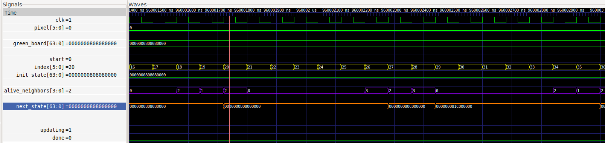
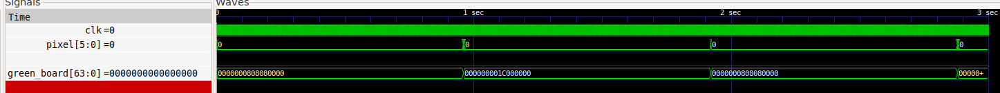

# MP3: Conway's Game of Life on WS2812B
Eddy Pan
30 October 2025

In this Mini-Project, I play three of Conway's Game of Life simultaneously on a WS2812B 8x8 RGB LED Matrix--one for each color channel.  


## Adaptable Sample Code
Much of this project was adapted from the `led_matrix` spiral example. I re-used the `ws2812b`, `controller` and parts of the `top` module to implement the game of life.


### Reused `ws2812b` Module
This module uses a two-state state machine to handle the timing protocol required by WS2812B LEDs. It converts serial RGB data into the specific format the WS2812B matrix expects.

### Reused `controller` Module
This module orchestrates the display timing and frame management for the LED matrix. Also as a two-state state machine, it alternates between transmitting pixel data to the WS2812B LEDs, and idling between frames. An important change that I made was modifying the `IDLE_CYCLES` calculation to match my desired frame rate of 1 frame a second. This required upping `IDLE_CYCLES` from  

(12,000,000 / 32) - 64 x (360 + 2) =  **351,832** cycles for 32 frames / second, to 

(12,000,0000 / 1) - 64 x (360 + 2) = **11,976,832** cycles for 1 frame / second.

## Implementation
Throughout this section, I'll be mainly referring to the `green_*` Game of Life implementation. Since the `red_*` and `blue_*` Game of Life modules are implemented the same way as `green_*`, I dive into the implementation of just the `green_*` module to reduce redundancy. 

### `game_of_life` module
This module calculate takes in an initial state (`init_state`), clock (`clk`), and `start` flag to calculate what its current state (`curr_state)` should be after an iteration of the Game of Life's rules. In addition to `curr_state`, it also outputs flags for `done` and `updating`.

I first instantiate three logics-- a 64-bit `next_state` temporary board, an `index` counter, and a register to count `alive_neighbors` of any given cell.

Next is an `initial` block that ensures the `done` and `updating` flags are set to 0.

The main logic occurs in these next two `always` blocks. The first is an `always_comb` which calls the `count_alive_neighbors` function and stores the result in the `alive_neighbors` register. The `count_alive_neighbors` function simply takes the board and index to count the alive neighbors of, finds the indices of all of the neighboring cells--taking the cyclic boundary conditions into account--and checks each cell for a 1, adding it to the return value. 

The last part of this module is the `always_ff` block that triggers on the positive edge of the clock tick, where an `if` statement resets `index` to 0, `updating` to high, and `done` to low (not done). Now, if `updating` is high, the Game of Life rules are applied on the `alive_neighbors` register computed in the earlier `always_comb` block. If the cell at the index meets the condition to be alive, then `next_state` is updated with a `1` at that index. If it does not, then it will be populated with a `0`. When `index` reaches `63`, the last one in the matrix, the `curr_state` output is assigned to the populated `next_state`, the `done` flag is set to high, and the `updating` flag set to low. If the index is not yet at `63`, it will increment by `1`. 


Here's what the simulation looks like for one iteration:



In this iteration, the `init_state` is passed in as a horizontal 'Spinner'. Once the `start` flag goes high, from `top`, the `always_ff` block switches to incrementing `index` from 0-63 and populating `next_state`.


At the start, `next_state` holds the previous value of the `init_state`, the horizontal Spinner. As `index` moves along, the bits in `next_state` are overwritten to match the 



At about index 20, a hexadecimal `8` (4b'0100) is replaced by a `0` (4b'0000).

At index 26, `alive_neighbors` reaches a `3`, meeting a condition to be alive, 

the hexadecimal changes from `8` (4b'1000) to `C` (4b'1100). At index 27, since `alive_neighbors == 2` and `init_state[27] == 1`, the cell stays alive, and stays at `C` (4b'1100) instead of dropping to `4` (4b'0100). Finally, at index 27, `alive_neighbors == 3`, 

the next hex `0` (4b'0000) turns into a `1` (4b'0001).
### `top` module
I organized the `top` module similarly to the `led_matrix` example. Since I keep track of each of my game states in a 64-bit register, where each bit represents if the cell at that index is alive or dead (1 or 0), I removed the `memory` modules. To initialize my game state from a file, I used an initial block with `$readmemh` to read in the initial 64-bits of each text file into an 1-element unpacked temporary array, `green_init_board`. In the `always_ff` block right after it that executes on the positive clock edge, I check a `board_initialized` flag to determine whether I initialize my `green_board` with the 64-bits from the `green.txt` file, or update my `green_board` to `green_next` computed from my `game_of_life` module.

Load shift register in conjunction with the `ws2812b` module to update `_48b` pin with the signal


## Testing and Validation
Using the GTKWave test, I ran my test bench for 3 seconds to capture 3 iterations of the Game of Life. Here are some results:



I tested my Game of Life implementation by initializing known "stable" patterns in my board initialization text files in `initial_led_state/`, and verifying that the next state matched the expected next iteration for that stable state. 

For example, in the image above, I am modeling the 'Spinner' pattern as a test case for validating my Game of Life code. In the image above, my pattern starts as: 

**Initial State:** `0x00_00_00_00_1C_00_00_00`
```
  0 1 2 3 4 5 6 7
0 . . . . . . . .
1 . . . . . . . .
2 . . ■ ■ ■ . . .   ← Row 2: bits 16-23 = 0x1C
3 . . . . . . . .
4 . . . . . . . .
5 . . . . . . . .
6 . . . . . . . .
7 . . . . . . . .
```

and transitions into its


**Next State:** `0x00_00_00_00_08_08_08_00`
```
  0 1 2 3 4 5 6 7
0 . . . . . . . .
1 . . . ■ . . . .   ← Row 1: bit 19 = 0x08
2 . . . ■ . . . .   ← Row 2: bit 27 = 0x08
3 . . . ■ . . . .   ← Row 3: bit 35 = 0x08
4 . . . . . . . .
5 . . . . . . . .
6 . . . . . . . .
7 . . . . . . . .
```

In simulation, the Spinner repeats over and over again between horizontal and vertical, which matches its expected behavior and thus validates this Game of Life implementation for this test case.

As further validation, in addition to the Spinner, I also tested the 'Glider' pattern, which is expected to move across the board and not die out. I set it up on the red channel, and in the video, I demonstrate its behavior of traveling through the cells on its diagonal.